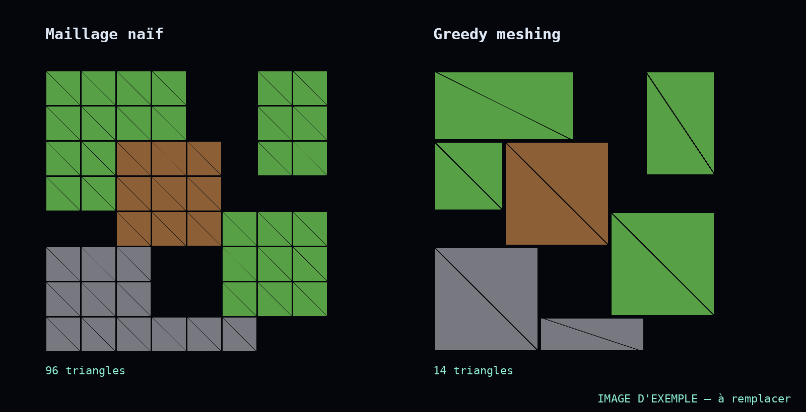

Exemple de billet de devlog. Raconte ici le problème, ce que tu as essayé,
ce qui a marché, et les chiffres (130k → 58k triangles).

## Le problème

Chaque face visible de chaque bloc devient deux triangles. Sur une grande surface plate,
ça fait des milliers de triangles pour dessiner… un rectangle.

## L'idée

Fusionner les faces voisines de même type en rectangles aussi grands que possible.

*Sur cette grille d'exemple : 96 triangles avant, 14 après.*

## Ce qui a coincé

<!-- À toi : les bugs, les faces manquantes, le cas des textures… -->
